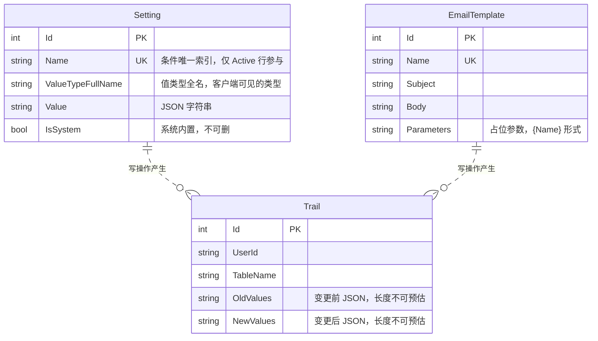
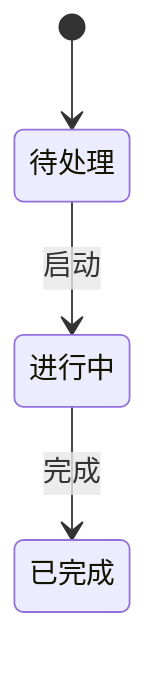
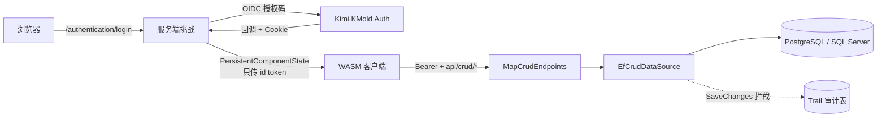

# CONTEXT — KMoldApp 全局业务地图

> 本文件是项目的**系统地图**，供 AI 与开发者快速建立全局认知。记「业务结构与流转」，不记实现细节。新增实体/变更流程时同步更新。
> 配套：消费 Kimi.AppKit 的硬约束见 `.claude/rules/appkit-consumption.md`；领域约束见 `.claude/rules/domain-constraints.md`；改码流程见 `.claude/rules/code-change-protocol.md`；决策见 `ADR/`。

- **项目定位**：`dotnet new` 模板的样例宿主。它同时是**两样东西**——
  ① 派生真实业务系统的起点；② `Kimi.AppKit` 七个包的**活体集成测试**：包里任何能力接不上，这里第一个暴露。
- **技术栈**：.NET 10 · Blazor Web App（全局 InteractiveWebAssembly）· MudBlazor 9 · EF Core 10 双 provider（PostgreSQL / SQL Server）· OpenIddict（经 `Kimi.KMold.Auth`）
- **顶层模块**：`KMoldApp`（服务端宿主）· `KMoldApp.Client`（WASM）· `KMoldApp.Shared`（两端共用契约）· `KMoldApp.Data`（实体与 DbContext）· `KMoldApp.Migrations.Npgsql` / `.SqlServer`（两套独立迁移）

---

## 0. 与 Kimi.AppKit 的关系（**改任何代码前先读**）

这是本模板最重要的一节。它不是普通依赖，而是**决定了「什么该写、什么绝不该写」**。

| 层 | 谁负责 |
|---|---|
| 审计轨迹 / 软删除 / 并发令牌 / 枚举 CHECK / UTC 归一 | `Kimi.AppKit.Data`，**不要重新实现** |
| 认证装配 / 默认拒绝授权 / 健康检查 / 异常处理 / 邮件 / Excel / 后台任务 | `Kimi.AppKit.Web` |
| 设计令牌与主题 | `Kimi.AppKit.Design`，**不要在应用里再写一份配色** |
| 通用组件（29 个 `K*`）与对话框 | `Kimi.AppKit.Components` |
| 反射驱动的 CRUD 页面 / 表格 / 表单 | `Kimi.AppKit.Crud` |
| 时区 / 展示名 / 分页契约 / 设置服务 | `Kimi.AppKit.Core` |

⚠️ **铁律：任何编码之前先检查 AppKit 是否已有实现。** 详细规则与踩坑记录见
`.claude/rules/appkit-consumption.md`——那份文件里的每一条都对应一次真实的返工。

---

## 1. 核心实体与关系（ER 图）

模板出厂只带两个**系统级**实体，业务实体由派生项目自行添加。

实体说明：

| 实体 | 职责 | 归属 | 关键约束 |
|---|---|---|---|
| `Setting` | 运行期可改的配置项 | 本项目 `KMoldApp.Data` | 实现 `IKSettingEntity`；⚠️ **刻意不进包**——进包意味着两套迁移跟包版本走、且客户不能加自己的列 |
| `EmailTemplate` | 邮件模板 | 本项目 | 软删除；`Name` 条件唯一 |
| `Trail` | 审计轨迹 | **包 `Kimi.AppKit.Data`** | ⚠️ `OldValues`/`NewValues` 长度不可预估，**不要用全局 string 长度约定套住它**（见 ADR-0002） |

<!-- TODO（派生项目填）：在此追加你的业务实体与关系。引导：核心实体有哪些？主外键关系？哪些需要软删除与审计？ -->

## 2. 关键状态机

模板出厂无状态机实体。

<!-- TODO（派生项目填）：列出带状态的核心实体及其合法迁移，标出哪些不可逆。
     ⚠️ 枚举以字符串存库且有 CHECK 约束（包的 ApplyEnumStringConstraints），
        **改枚举成员后必须重新生成两套迁移**，否则写入新值撞约束。 -->

## 3. 核心业务流程 / 数据流转

出厂只有一条主干：**登录 → 授权 → CRUD**。

流程说明：

1. **登录**：`/authentication/login` 发起 OIDC 挑战 → IdP 认证 → 回调写 Cookie →
   `PersistingAuthenticationStateProvider` 把身份序列化给 WASM。
   ⚠️ **只传 id token，不传 refresh token**——后者是长期凭据，续期由服务端 Cookie 校验时自动完成。
2. **授权**：两层。端点级 `FallbackPolicy`（默认拒绝）管「能不能到达」；
   组件级 `AuthorizeRouteView` + `[Authorize]` 管「到达后给不给看」。
   ⚠️ 策略定义在 `KMoldApp.Shared`，**两端共用一份**。
3. **CRUD**：WASM 页面 → `KHttpCrudDataSource` → `MapCrudEndpoints` → `EfCrudDataSource` → DbContext。
   ⚠️ 写操作由 `AuditableDbContext` 在 `SaveChanges` 拦截并产生审计轨迹。

<!-- TODO（派生项目填）：追加你的业务主流程。 -->

## 4. 模块职责速查

| 模块 | 职责 | 上游 | 下游 |
|---|---|---|---|
| `KMoldApp` | 服务端宿主：装配、端点、预渲染 | 浏览器 | `KMoldApp.Data`、AppKit.Web/Crud |
| `KMoldApp.Client` | WASM 端：页面、布局、客户端数据源 | 服务端预渲染 + HTTP | `api/crud/*` 端点 |
| `KMoldApp.Shared` | 两端共用契约：角色/策略、`UserInfo`、DTO | —— | 被上面两者引用 |
| `KMoldApp.Data` | 实体、`KMoldDbContext`、provider 接线 | 服务端 | 数据库 |
| `KMoldApp.Migrations.*` | 两套**互不共用**的迁移 | 设计时工具 | 数据库 |

⚠️ **一个 provider 一套迁移**：迁移文件里的列类型是生成那一刻烤进去的字符串
（PG `character varying(100)` vs SQL Server `nvarchar(100)`），共用一套时
`migrations script` 只会换标识符引号、列类型仍是另一个库的写法——脚本能生成、能过 review，到目标库执行才炸。
